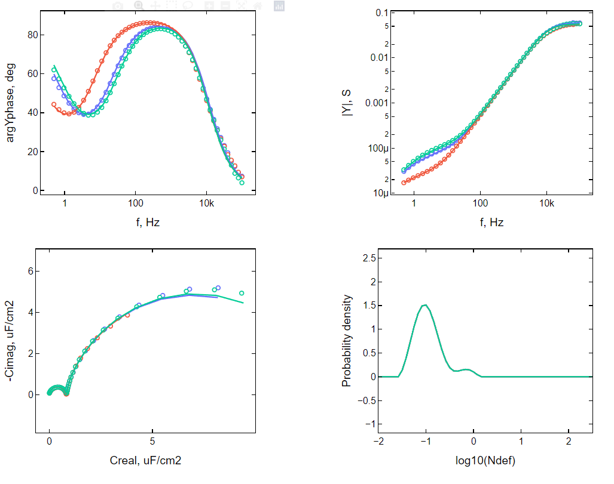
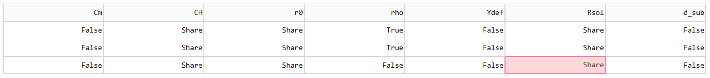

### This Depository is for fitting electrochemical impedance spectra of tethered lipid bilayer. 

Model used is discribed in folowing publicaitons [doi.org/10.1021/la204054g], [doi.org/10.1016/j.bioelechem.2022.108092]. Fitting procedure herein extends homogenouse admittance model to heterogenouse model by assuming some unknown underlying denisty destribution funciton.

$Y_{tot} = \int{Y(N_{def}, f) P(N_{def})} dN_{def}$

Distribution funciton $P$ is obtained by solving regularized and discretized version of equation above [doi.org/10.1016/j.bioelechem.2022.108092].

Main Purpose is to simultaniously fit sever spectra that share distribution function, or one spectra at a time otherwise. pH change, tempreture change or electorde polarization can influance some parameters of the model:

$C_H$ - Helmholtz capacitance

$C_m$ - memrbane capacitance

$\rho$ - submembrane resistance

$d_{sub}$ - thickness of submebrane reservoire

$< N_{def} >$ - average defect density

$r_0$ - defect radius

Some of these parameters cannot be identified simultaneously, hence choice of parameters to fit, not to fit or fit a shared parameter should be based on valid physical assumptions. For example, changing pH may change $C_H$, $C_m$, $\rho$, $< N_{def} >$. $\rho$ and $< N_{def} >$ are collinear, that is why $\rho$ should always be a fixed value when fitting a single spectrum, however when sever spectra are fitted $\rho$ is expected to be varied between spectra, hence only one $\rho$ should be fixed. $< N_{def} >$  is shared between all spectra, because it is calculated by integrating  $N_{def} P(N_{def})$ and $P(N_{def})$ is a shared distribution, so if $< N_{def} >$ is expected to be variable spectra should be fitted separately. 

Figure above displays electrochemical impedance spectra of the same tBLM, but at different pH values. Examining Cole-Cole diagram of experimental spectra (empty circles), makes it apparent that neither $C_H$, nor $C_m$ change, so these parameters are also shared. Fits of $r_0$ are usually poor, so when good estimates are available they should be used instead, for more detailed discussion on impact of $r_0$ on admittance spectra is available at [doi]. Since all curves are fitted reasonably well, the assumption that $P$ does not change based on H$^+$ concentration is valid. The matrix that sets parameters that were fixed, shared or fitted is shown below. 

True - fit seperate value

False - use predefined value

Share - fit shared value

### Instalation

### To use install these python packeges:

pip install numpy

pip install scipy

pip install matplotlib

pip install dash

pip install jupyter-dash

pip install dash-daq

### If you are using Anaconda distribution, only additional packages that should be instaled are: 

conda install -c conda-forge dash

conda install -c conda-forge jupyter-dash

conda install -c conda-forge dash-daq

