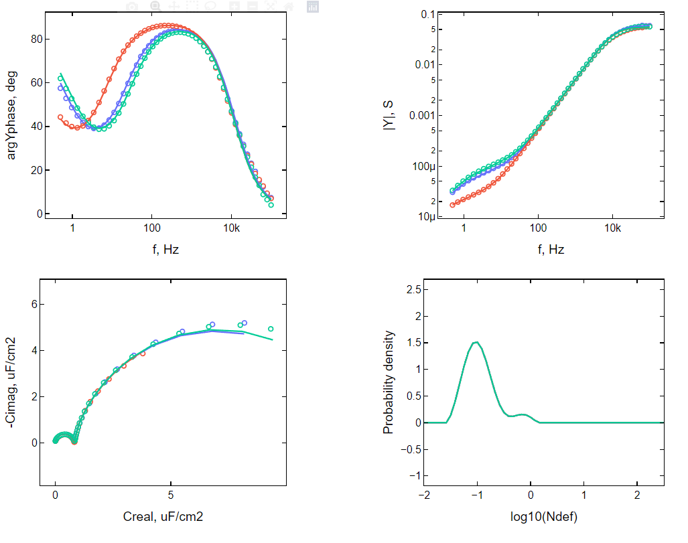
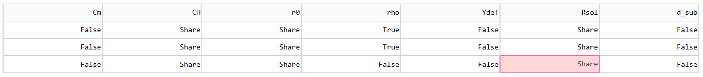

### This Depository is for fitting electrochemical impedance spectra of tethered lipid bilayer. 

Model used is discribed in folowing publicaitons [doi], [doi]. Fitting procedure herein extends homogenouse admittance model to heterogenouse model by assuming some unknown underlying denisty destribution funciton.

$ Y_{tot} = \int{Y(N_{def}, f) P(N_{def})} dN_{def}$

Distribution funciton $P$ is obtained by solving regularized and discretized version of equation above [doi].

Main Purpose is to simultaniously fit sever spectra that share distribution function, or one spectra at a time otherwise. pH change, tempreture change or electorde polarization can influance some parameters of the model:

$C_H$ - Helmholtz capacitance

$C_m$ - memrbane capacitance

$\rho$ - submembrane resistance

$d_{sub}$ - thickness of submebrane reservoire

$<N_{def}>$ - average defect density

$r_0$ - defect radius

Some of these parameters cannot be identified simultaniously hence choise of paramters to fit, not to fit or fit a shared paramter should be based on valid physical assumptions. For example, changing pH migh change $C_H$, $C_m$, $\rho$, $<N_{def}>$. $\rho$ and $<N_{def}>$ are colinear, that is why $\rho$ should always be a fixed value when fitting single spectrum, however when sever spectra are fitted $\rho$ is expected to be varried between spectra only one $\rho$ should be fixed. $<N_{def}>$  is shared between all spectra, because it is calculated by integrating  $N_{def}P(N_{def})$ and $P(N_{def})$ is a shared destribution, so if $<N_{def}>$ is expected to be varraible spectra should be fitted separetly. 

Figure above displays electrochemical impedance spectra of the same tBLM but at different pH values. Examening Cole-Cole diagram of experimental spectra (empty circles), makes it appearent that neither $C_H$, nor $C_m$ change, so these parameters are also shared. Fits of $r_0$ are ussualy poor, so when good estimates are available they should be used instead, for more detaled discusion on impact of $r_0$ admittance spectra is avaleble at [doi]. Since all curves are fitted reasonably well assumption that $P$ does not change based on H$^+$ concentration is valid. Matrix for wich parameters were fixed, shared or fitted is shown below. 

True - fit seperate value

False - use predefined value

Share - fit shared value